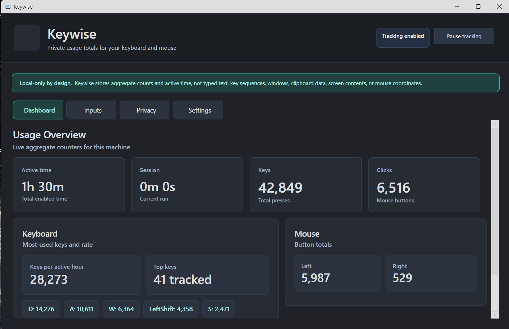
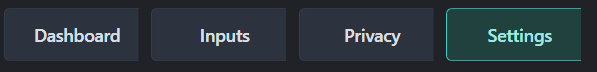

# Keywise

Privacy-first Windows desktop usage analytics prototype.

## Current Status

This is an AI-generated prototype with an initial security review.

The app currently includes:

- WPF dashboard
- Tray icon
- Enable/pause tracking toggle
- Local JSON aggregate storage
- Aggregate key and mouse counter model
- Active tracking time and session duration
- Privacy and settings screens
- Light/dark UI theme following Windows app settings
- Global Windows input hooks for aggregate tracking

## Screenshots





## Privacy Model

The app is designed to store aggregate counters only, including key/button totals, active tracking time, app launch count, pause count, and per-day aggregate totals. It must not store typed text, ordered key sequences, per-key timestamps, window titles, app names, URLs, clipboard data, screenshots, mouse coordinates, or raw input logs.

## Build

```powershell
dotnet build
```

## Run Prototype

```powershell
dotnet run
```

## Planned Install Layout

```text
%LOCALAPPDATA%\Programs\Keywise\
%LOCALAPPDATA%\Keywise\
```

Startup should be disabled by default and enabled only by explicit user choice.

## Release Packaging

See [Release.md](Release.md). The release path creates a Windows installer, portable zip, and SHA-256 checksum file. Code signing should be added before broad public distribution.

## Windows SmartScreen

Keywise is currently unsigned, so Windows SmartScreen may warn that the installer is not commonly downloaded. Only download Keywise from the official GitHub Releases page and verify the published SHA-256 checksum if you want an extra integrity check.
